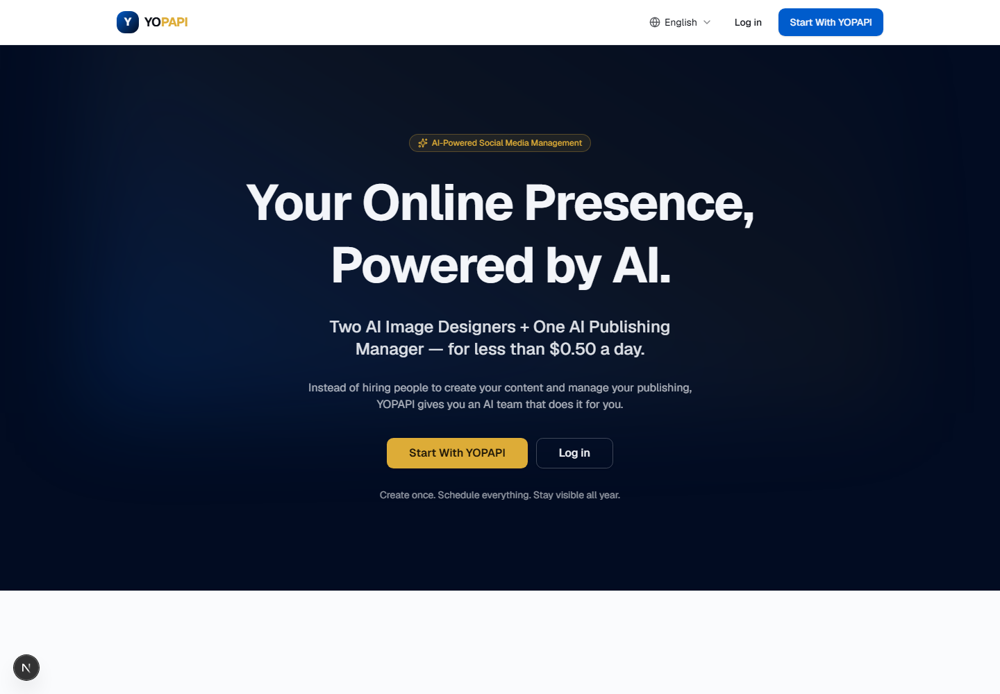
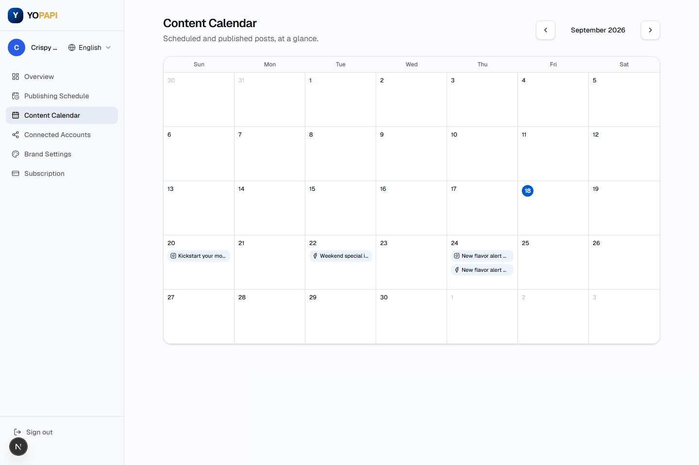

<div align="center">

# SocialPilot

**An AI social media team, in a box.**
Two AI image designers and one AI publishing manager that create on-brand
content and publish it to Instagram and Facebook on autopilot — for less
than $0.50 a day.

[](https://github.com/AbdullahHAK/SocialPilot/actions/workflows/ci.yml)


**[▶ Live demo — yopapi.com](https://yopapi.com)** ·
[SocialPilot base deployment](https://web-ten-opal-64.vercel.app) ·
[Report an issue](https://github.com/AbdullahHAK/SocialPilot/issues)

</div>

<br>

<p align="center">
  
</p>

## What it does

A business connects its Instagram and Facebook, tells the app about its
brand once, and picks a weekly posting schedule. From there, SocialPilot
runs the whole content loop by itself:

1. **Generates** an on-brand image (`gpt-image`) and a caption written for
   that image, the brand's tone, and its products (`gpt-4o-mini`) —
   starting only ~5 minutes before a post is due, so nothing goes stale
   sitting in a queue.
2. **Publishes** to Instagram and Facebook via the Meta Graph API, feed
   post and auto-Story, and verifies the post actually landed rather than
   trusting the API call didn't throw.
3. **Retries** with exponential backoff on transient failures, self-healing
   if a disconnected account gets reconnected before the retry window runs
   out — but fails permanently, right away, for conditions no retry could
   ever fix (a revoked token), instead of quietly burning attempts for an
   hour.

<p align="center">
  
</p>

## Highlights

<table>
<tr>
<td valign="top" width="50%">

**Product**
- Guided onboarding, weekly + one-time scheduling, a real content
  calendar (agenda view on mobile), Instagram/Facebook OAuth connect
- The [yopapi.com](https://yopapi.com) white-label deployment layers on
  top: single-page onboarding, AI "content instructions" (redirect what
  the AI writes next instead of hand-writing captions), and a full admin
  control panel — role-based staff accounts, customer management,
  subscription overrides, manually-issued activation codes, an audit log
  of every admin action

</td>
<td valign="top" width="50%">

**Engineering**
- Multi-tenant from the schema up, with a white-label brand switch that
  lets one codebase power multiple differently-branded products from the
  same database — this repo runs both the
  [SocialPilot demo](https://web-ten-opal-64.vercel.app) and
  [yopapi.com](https://yopapi.com)
- yopapi.com adds English / French / Arabic, including full RTL layout —
  verified with an automated `scrollWidth`-vs-`clientWidth` check across
  every page and locale, not just eyeballing it
- A real test suite across `web` / `worker` / `db`, run against a real
  local Postgres in CI, no mocked ORM

</td>
</tr>
</table>

## Architecture

```
apps/web      Next.js 16 (App Router) — dashboard, marketing site
              (yopapi.com adds an admin panel on top)
apps/worker   Node.js polling service — content generation + publishing loop
packages/db          Prisma schema + client, shared by web and worker
packages/content-engine   OpenAI image/caption generation, brand-prompt building
packages/config      Shared TypeScript/ESLint config
```

| Layer | Choice |
|---|---|
| Frontend | Next.js (App Router, Server Actions), Tailwind, shadcn-style components |
| i18n | next-intl on the white-label deployment — cookie-based locale, no URL prefixing, RTL-aware |
| Database | PostgreSQL via Prisma, Neon in production |
| AI | OpenAI image generation + `gpt-4o-mini` for captions |
| Social | Meta Graph API (Instagram Business + Facebook Pages) |
| Storage | S3-compatible object storage (Cloudflare R2) for generated images |
| Billing | Stripe Checkout + customer portal |
| Hosting | Vercel (web), Railway (worker), Neon (Postgres) |
| Testing | Vitest + Testing Library, integration tests against real Postgres |

## Getting started

```bash
cp .env.example .env      # fill in values for the phase you're working on
docker compose up -d      # Postgres + Redis
pnpm install
pnpm db:migrate           # applies Prisma migrations
pnpm dev                  # apps/web on :3000
pnpm dev:worker           # apps/worker, in a separate terminal
```

```bash
pnpm lint          # eslint, every workspace
pnpm typecheck      # tsc --noEmit, every workspace
pnpm test           # vitest, web + worker + db
pnpm build          # production build, every app
```

## License

Proprietary — all rights reserved. Source is public for portfolio review;
not licensed for reuse.
